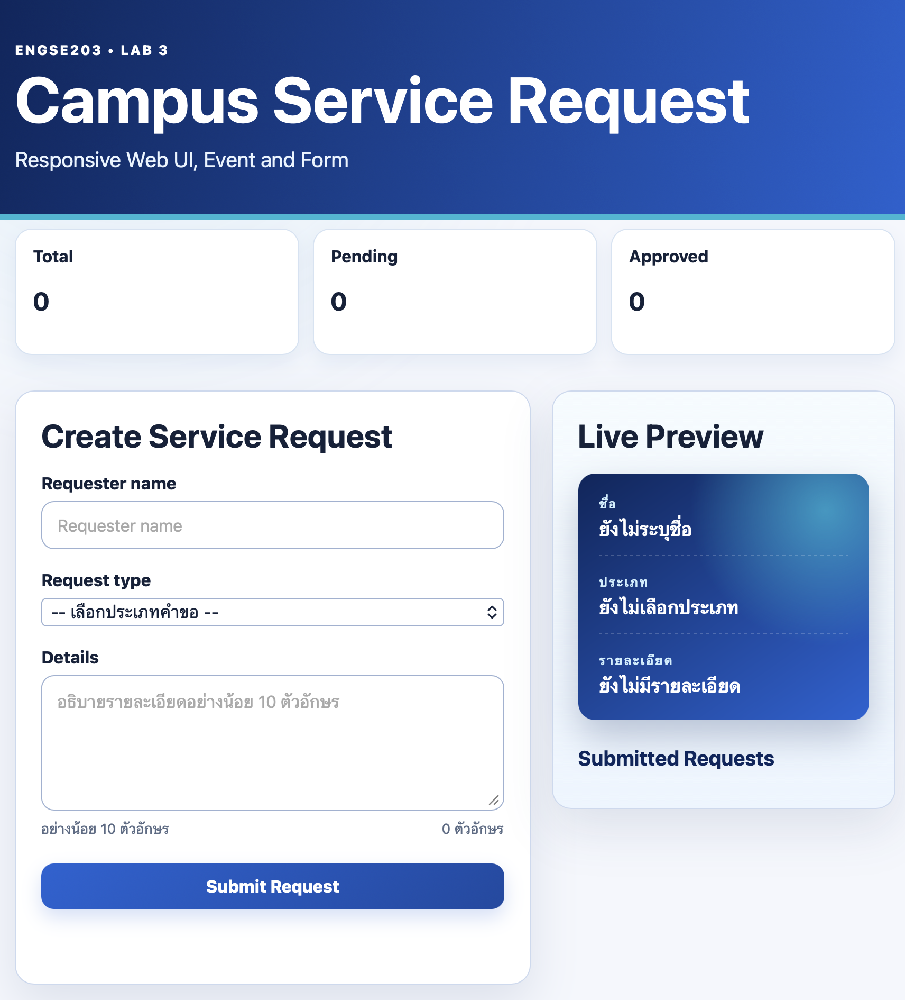
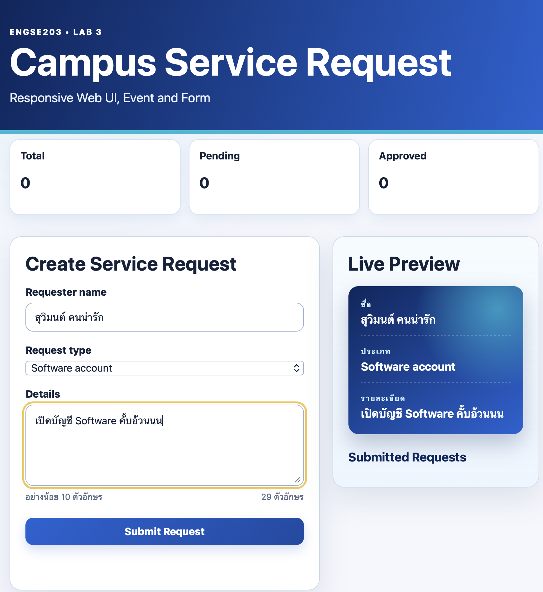
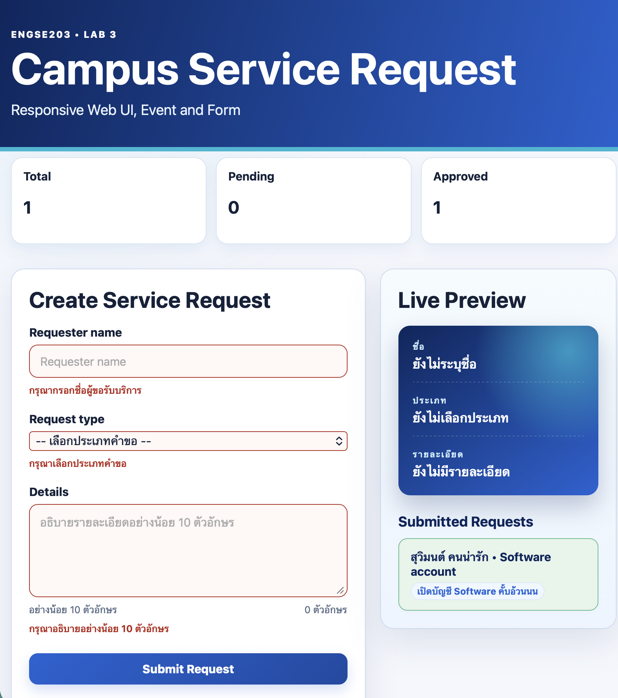
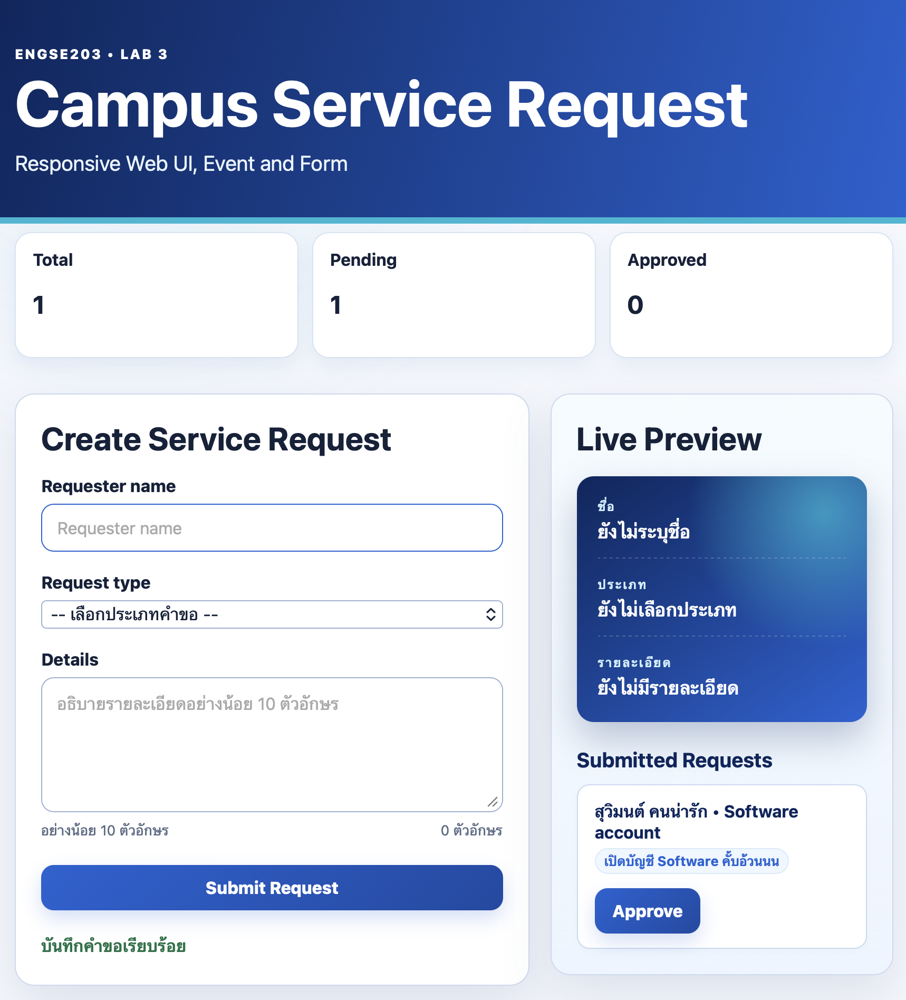
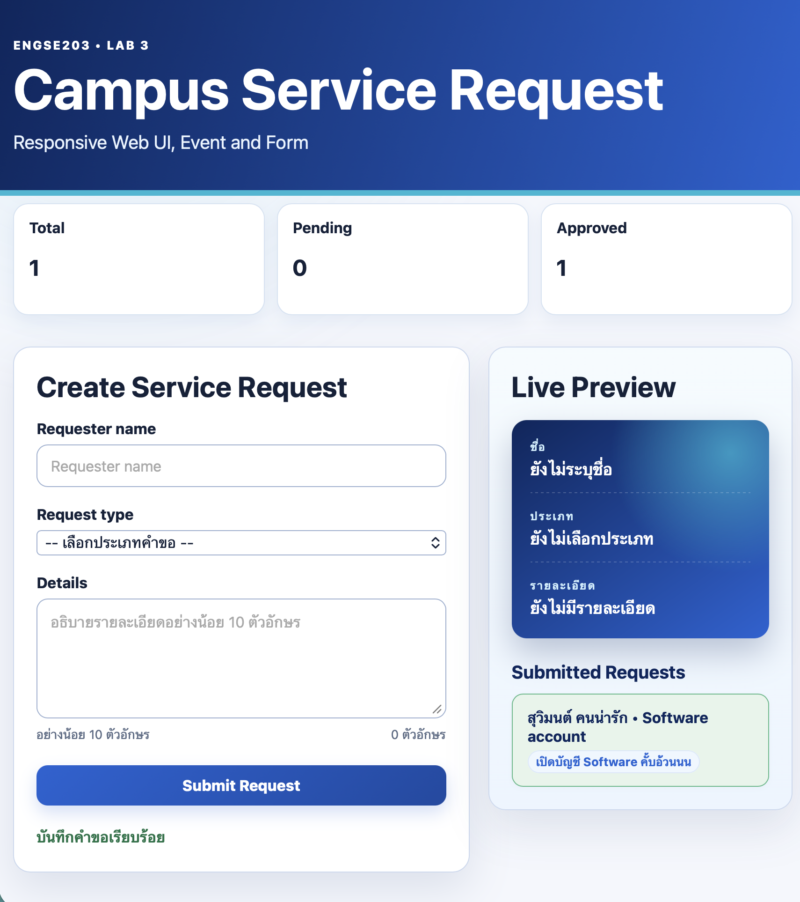

# Week 03 Evidence

ควรมี screenshots desktop/mobile, form valid/invalid และผล manual test

## หน้าเว็บหลัก

## กรอกข้อมูล

## แจ้งเตือน (Form Invalid)

## แสดง Request

## แสดงจำนวน Request

## Manual Test Results

| Test Case | Expected | Actual | Result |
|---|---|---|---|
| กรอกข้อมูลครบถ้วน | ส่งฟอร์มสำเร็จ | ส่งสำเร็จ | ✅ Pass |
| กรอกข้อมูลไม่ครบ | แสดงข้อความแจ้งเตือน | แสดงข้อความแจ้งเตือนถูกต้อง | ✅ Pass |
| แสดงจำนวน Request | นับจำนวนถูกต้อง | ถูกต้อง | ✅ Pass |